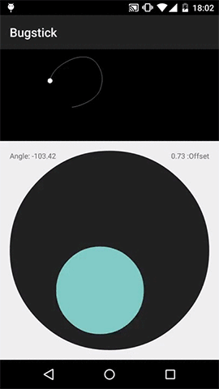

Bugstick
========
Flexible joystick widget for Android.



Why Bugstick?
-------------
Most [other][zerokol-joystickview] [joystick][anarchy-joystickview] [widgets][sphero-joystickview]
are a hassle to include in modern Gradle-based Android projects, support only limited visual
customization, and suffer from overly prescriptive output.

So how does Bugstick solve these issues?

- *Painless Dependency* - try it out quickly with a simple Gradle dependency.

- *Configurable Look* - the joystick base and stick are a completely decoupled, standard
ViewGroup - View pair. Use an `ImageView`, `Button`, `LinearLayout`, or any other View as
the stick, and use standard `Drawable`s to theme Bugstick so it looks at home in your app.

- *Unopinionated Output* - the widget reports proportional offset of the stick from its center as
well as the current angle via a standard listener interface. Choose to interpret these raw outputs
in the way that suits your use case.

Usage
-----
Add it to your project using Gradle:

```groovy
compile 'com.jmedeisis:bugstick:0.2.0'
```

Example XML layout file:

```xml
<com.jmedeisis.bugstick.Joystick
    android:id="@+id/joystick"
    android:layout_width="@dimen/base_size"
    android:layout_height="@dimen/base_size"
    android:background="@drawable/bg_base">

    <!-- You may use any View here. -->
    <Button
        android:layout_width="@dimen/stick_size"
        android:layout_height="@dimen/stick_size"
        android:background="@drawable/bg_stick" />

</com.jmedeisis.bugstick.Joystick>
```

Note that the `Joystick` ViewGroup supports only one direct child, but that child can be another
ViewGroup such as a `FrameLayout` with multiple children.

After inflating the layout, you will typically listen for joystick events using a
`JoystickListener`:

```java
Joystick joystick = (Joystick) findViewById(R.id.joystick);
joystick.setJoystickListener(new JoystickListener() {
    @Override
    public void onDown() {
        // ..
    }

    @Override
    public void onDrag(float degrees, float offset) {
        // ..
    }

    @Override
    public void onUp() {
        // ..
    }
});
```

Please refer to the included [sample project](sample/) for a thorough example.

Configuration
-------------
You can configure the following attributes for the `Joystick` class:

- `start_on_first_touch` - If true (default), the stick activates immediately on the initial touch.
If false, the user must begin to drag their finger across the joystick for the stick to activate.

- `force_square` - If true (default), the joystick always measures itself to force a square layout.

- `radius` - If specified, this is the maximum physical offset from the center that the stick is
allowed to move. If not specified (default), the radius is determined based on the dimensions of
the base and the stick.

- `motion_constraint` - One of `None` (default), `Horizontal`, or `Vertical`. Specifies whether the
stick motion should be constrained to a particular direction. If `None`, the stick is allowed to
move freely around the center of the base.

Example configuration:

```xml
<com.jmedeisis.bugstick.Joystick
    android:id="@+id/joystick"
    android:layout_width="@dimen/base_width"
    android:layout_height="match_parent"
    android:background="@drawable/bg_base"
    app:start_on_first_touch="false"
    app:force_square="false"
    app:radius="@dimen/stick_offset_max_radius"
    app:motion_constraint="Vertical">

    <!-- Any View here. -->

</com.jmedeisis.bugstick.Joystick>
```

License
-------
Bugstick is licensed under the terms of the [MIT License](LICENSE.txt).

[zerokol-joystickview]: https://github.com/zerokol/JoystickView
[anarchy-joystickview]: https://code.google.com/p/mobile-anarchy-widgets/wiki/JoystickView
[sphero-joystickview]: https://github.com/orbotix/Sphero-Android-SDK/tree/master/samples/UISample#joystick-view